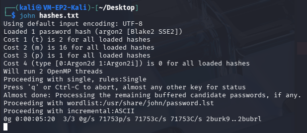

# Secured Webshop

Projet pédagogique utilisé dans le cadre du cours **183 - Sécurité des applications** (ETML).

Cette application est un serveur web Node.js qui regroupe deux parties : un **backend** (API REST en Express qui communique avec la base de données MySQL) et un **frontend** (pages HTML avec **Vue option API** servies directement par le même serveur). Les pages web appellent l'API via `fetch()` pour afficher et modifier les données.

## 1) Frontend: page login

- J'ai d'abord mis les différents champ nécessaires à la connexion coté html dans ce '[commit](https://github.com/StepCode3630/secured_webshop/commit/7b01c46db1f7ac2277dfac93b9be1dfeff591b0b#diff-b85e06b98b12219e81dc5ef9f54cc699ad58727e0809073734c0d6678d017b71)'

- Ensuite pour la connexion backend, j'ai utilisé **Vue.js option API** avec **_v-model_** pour facilement transmettre les données entre l'html et le js (et invérsement d'ailleurs)
- Puis coté JS, j'ai mis un **data** qui récupère ces données et je crée une méthode async **_handleSubmit_** qui envoie la requête de connextion vers l'API /auth/login et pour oui ou non la vadlider.

Code disponible dans ce [commit](https://github.com/StepCode3630/secured_webshop/commit/9d9aaa32625636a2b0f778c1bd17b548a49af3a2#diff-510581575406054593c8c45c85e2fc9c87caafdb6d040fb88eb8b3a6efad7a53)

PS: Le login de authController permet deja d'avoir une connexion fonctionel sans sécurité

## 2) Frontend: page inscription

- J'ai d'abord créer les champs nécessaires à l'inscription coté html avec des **_v-model_**
- Ensuite je récupère ces données via un **data** et j'ai une méthode **_handleRegister_** qui envoie la requête vers l'API /auth/register et valide ou non l'inscription puis redirige vers /login pour se co
- Puis créer le controller d'inscription qui qui contrôle si tout les champs obliguatoires sont présents, créer une requête **insert into** avec les données récupérés et renvoie si ça a fonctionné ou non

Code disponible dans ce [commit](https://github.com/StepCode3630/secured_webshop/commit/4830ab395c5f716eda6a165c497a10b2dfa5f800#diff-7ff0043793a044c51ccd3464f600aec58051af3dafa3980c0e92732cf13a6ed5)

## 3) BDD: remplacer les mdp en clair

- J'ai utilisé **Argon2id** car l'un des meilleurs hasheurs
- J'ai créer 2 fonctions, **hashPassword** qui permet de hash où on peut paramétrer les args, **verifyPassword** qui permet de vérifier le mdp via une fonction **_argon2.verify_**
- Utilisation de ses fonctions dans le authController de login et register

Code disponible dans ce [commit](https://github.com/StepCode3630/secured_webshop/commit/cada866bc4fbef945360c5eda3219e188c6b706b#diff-d2d18d2598c345c318df578d5c2091d7a403f32b4dcf0131b6521daf03d4fc78)

Amélioration du code en mettant de meilleurs fonctions dans ce [commit](https://github.com/StepCode3630/secured_webshop/commit/69a8697cc613699334c69dee3e86f31245bb6e55#diff-d2d18d2598c345c318df578d5c2091d7a403f32b4dcf0131b6521daf03d4fc78)

## 4) Ajout du sel

- Argon mets automatiquement un sel par défault

Code disponible dans ce [commit](https://github.com/StepCode3630/secured_webshop/commit/4a0824cc67fab4596c8a4c5d710fd965a38f9765)

## 5) Ajout du poivre

- Création d'un pepper dans le .env
- Hash du password pas encore hashé avec le pepper dans les fonctions **hashPassword** et **verifyPassword**

Code disponible dans ce [commit](https://github.com/StepCode3630/secured_webshop/commit/061961310cd1a96e70842c8e8c0e82da4a47b324)

## 6) Corriger les requêtes / injection

- Utiliser des requêtes préparés en créant une requête de base sans les infos de l'user
- Puis exectuer la requête avec infos avec gestion des erreurs

Code disponible dans ce [commit](https://github.com/StepCode3630/secured_webshop/commit/fbf386f2cec8187e92a1cd016b714dbe3a8a0288)

## 7) Implémenter token JWT

- J'ai utilisé JOSE pour le jwt, cookie parser pour stocker le token dans les cookies et dotenv
- Mis dans le .env le text jwt secret et la durée
- J'ai créé un token avec les champs clé nécessaire (donnée de l'user et durée du token)
- Envoie ce token vers le client (naviguateur) avec certains paramètres
- Mis le cookies dans le midlleware qui prend le token et le mets dedans
- On vérifie si le token est valide dans le middleware
- Mis en type EsModule

Code dispo dans ces commits suivants:
[Commit v1](https://github.com/StepCode3630/secured_webshop/commit/2d73f7573d5f497c0d91aa464b2e6dbfb3167645) [EsModule](https://github.com/StepCode3630/secured_webshop/commit/44d71ab47e512e65a0c4c5ad50158a7b6852f2f1) [Commit v2](https://github.com/StepCode3630/secured_webshop/commit/09418e4e3e13b734ca973549d9c0ce0c2539fd9f)

## 8. Ajout er les rôles dasn Jwt + protégéer les routes admin

- J'ai ajouté le role de l'user dans le paylod
- J'ai ajoutl dans le middleware une constante adminOnly qui vérifie si le rôle de l'user est admin ou non
- Ensuite j'ai importé la constante adminOnly et l'ait mis dans la route admin

Code dispo dans ce [commit](https://github.com/StepCode3630/secured_webshop/commit/4f8a7407823eb4163b45a0a65e5c99a7f870f370)

## 9. Politque de mot de passe

- J'ai ajouté une fonction qui permet de valider un mot de passe selon une politique (min. 8 caractères, avec lettre minuscules et maj, etc...)
- Mis cette fonction dans le authController pour vérifier si le password saisi est valide
- Implémeter le front end avec html, css et js (vue)

Code dispo dans ces commits: [commit](https://github.com/StepCode3630/secured_webshop/commit/562f6549f56f514a13d23cab22fba5af0c1b506c#diff-d2d18d2598c345c318df578d5c2091d7a403f32b4dcf0131b6521daf03d4fc78) , [commit Meilleur frontend](https://github.com/StepCode3630/secured_webshop/commit/8195aace2dc04926f1edc07bcdd65783c1bba49d)

## 10. Limiter le nombre de tentatives de login (5 par 1min)

- Installé express-rate-limit via npm
- mis dans server.js un limiter
- J'ai ajouté des messages en fonctions des erreurs dans le authController
- Implémenter le front end avec html, css et js dans la methode handleSubmit où je renvoie les erreurs

Code dispo dans ce [commit](https://github.com/StepCode3630/secured_webshop/commit/9f690290b9c9365b4a0b61686857c4d977acff18#diff-02bedb39cb8b25670e4e85144002f256b1a04373d239a9454a650ad1827a13eb)

## 11. routes https

- Installé fs et https via npm
- ajouté des const des params et mis le https dans le server.js
- lancé une commande pour généré les certification

Code dispo dans ce [commit](https://github.com/StepCode3630/secured_webshop/commit/cd7fc5f29e44c729545d8f68527b2ea70facb5aa#diff-02bedb39cb8b25670e4e85144002f256b1a04373d239a9454a650ad1827a13eb)

## 12. Audit les dépendances NPM

- Effectué la commande
  ```bash
  npm audit fix
  ```

## 13. Vérifier la résistance des hash

- J'ai utilisé une VM sous Kali Linux pour pouvoir installer John Ripper
- Installé John the Reaper via shell
- J'ai pas réussi à tester avec un mot de passe hashé avec Argon2id, j'ai donc hashé avec Argon2D, mis un mot de passe min fort comme _Qwertz1234.!_
- Résultat, après 10 min, il a du mal:
  

## 14. Ajouter un honeypot (pas demandé)

- J'ai installé la librairie **express-admin-honeypot**

- Créé une fonction **_MiddlePot_** comme Middleware qui créé une fausse page admin et log des infos de l'user
- Créé des fausses routes admin avec middlewaire **_MiddlePot_**
- Ajuster la fonction **_authenticateToken_** pour rediriger vers fausse page admin si pas de token
- Dans server.js , j'ai ajusté la route /api/admin, et que si on tente d'accéder à /admin alors on se fait rediriger vers la fausse page admin /wp-admin

Code dispo dans ce [commit](https://github.com/StepCode3630/secured_webshop/commit/ba73f4a810fd818e39a69a31463db06e1262c55a)

## 15. Gérer les exceptions

- éviter les message du genre

```bash
error: err.message
```

Mais priviligier

```bash
error: "Erreur serveur" //ou autre message peu détaillant
```

pour qu'un attaquant ne puisse pas "deviner" les erreurs potentiels

- Middlewaire global recommandé situé à la fin de **server.js**

  Il permet de capturer les erreurs async, routes et middleware et évite crachs et / ou fuites d'infos

## Chiffrement des données sensibles ( pas terminé)

- Installé dépendances _crypto_
- Mis dans le .env une clé crypto
- Créer un services pour chiffrer via AES-256, déchiffrer, chiffrer en string, déchiffrer depuis le string
- Import des fonctions, chiffrer email et adress avant insert dans la db dans register authController
- Déchiffer infos lors de login dans login authController
- Déchiffrer les infos dans la page profil dans profilController
- Déchiffrer les infos de l'user dans la page admin dans AdminController

Code dispo dans ce [commit](https://github.com/StepCode3630/secured_webshop/commit/883289a36c6386729e393d6315062dd14dbb533d)

# Conclusion

Je me suis assez appliqué sur le code en général, j'ai utilisé l'IA pour m'aider à comprendre certaines points surtout sur le token JWT et chiffrement/déchiffrement. J'ai appris beaucoup de chose concernant la sécurité en général mais surtout pour une app web.
